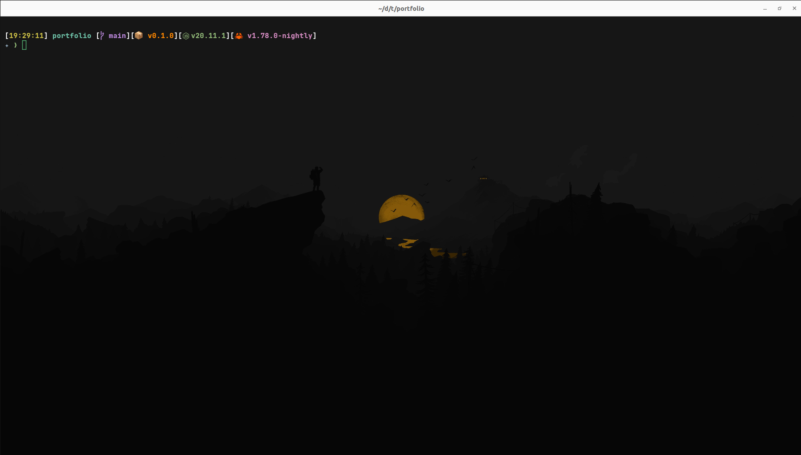
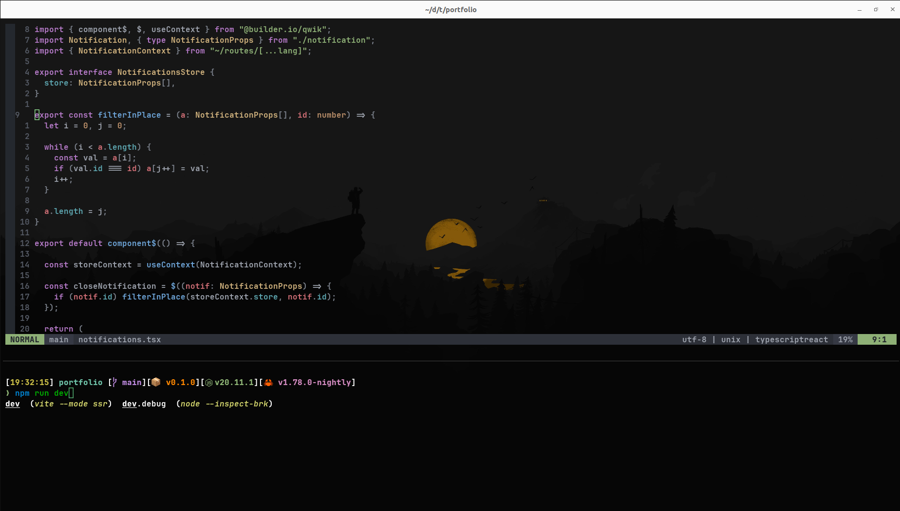

# The cat dotfiles on Ubuntu

My dotfiles are just my linux minimal configuration for some tools I use to make my terminal experience awesome.
It contains my ideavimrc as well as I am mainly a Java developer.
If you want to use them or just pick few things in it, feal free to do so, but at your own risk :smirk:.




## Contents

- fish
- wezterm
- neovim
- starship
- gitui
- ideavimrc

## Installation 

### Set up your environment

> **Note**
> I personally use environment variables to setup my stuff on different systems and i often keep the same ordering of folders. You can follow along if you like or do something completly different but you will have to search for every path in every lua file to be sure everything is at the write place on disk

```sh
 export DEV=~\dev
 export HOME=~
```

### Clone this repo

- clone it under your home directory 
```sh
git clone <url> ~/.dotfiles
```

### Install Wezterm 

#### Build from source
- Rust : [install rust](https://www.rust-lang.org/)
- Wezterm : [download and build](https://github.com/wez/wezterm)

#### Install release or nightly
- Wezterm : [download and install](https://wezfurlong.org/wezterm/installation)

### Install Fish 

- Install fish : [install](https://fishshell.com/)

### Install Zoxide

- Zoxide : [install](https://github.com/ajeetdsouza/zoxide)

### Install Starship

- Starship : [install](https://github.com/starship/starship)

### Install Ripgrep

- Ripgrep : [install or build from source](https://github.com/BurntSushi/ripgrep)
- Add rg to Path

### Install Fzf

- Fzf : [install](https://github.com/junegunn/fzf)
- Add fzf to Path

### Install Bat 

- Bat : [install](https://github.com/sharkdp/bat)
- Add bat to Path

### Install Eza 

- Eza : [install](https://github.com/eza-community/eza)
- Add eza to Path


### Install Neovim

- Neovim : [download](https://github.com/neovim/neovim) and [build it from source](https://github.com/neovim/neovim/blob/master/BUILD.md)
- Add nvim.exe to Path
- LSP in neovim will require you to have each langage toolchain to be setup but you might not require them all. The list can be found in .config/nvim/after/plugin/mason_lsp.lua comment some all or none of them at your convinience.

### Install Gitui

- Gitui : [download or build from source](https://github.com/extrawurst/gitui)
- Add gitui to Path

### Install GitButBetter

> **Warning**
> This is one of my personal project and it is not ment to be use by anyone but me so you better go inside .config/wezterm/wezterm.lua and change { 'gbb', 'ui' } by the 'gitui' command.
- GitButBetter : [downlaod and build from source](https://github.com/theCat69/git-but-better)
- add gbb to path

### Link the configuration

- Install stow
```sh
apt update
apt install stow
```

- Open terminal in this project folder and run 
```sh
stow . 
./install-scripts/deploy-starship.sh 
```

- If you use IntelliJ you can additionaly use my ideavimrc 
```sh
./install-scripts/deploy-ideavimrc.sh 
```

### Take a break

Get a nice and cold bear. Sit, relax, open wezterm and enjoy !

